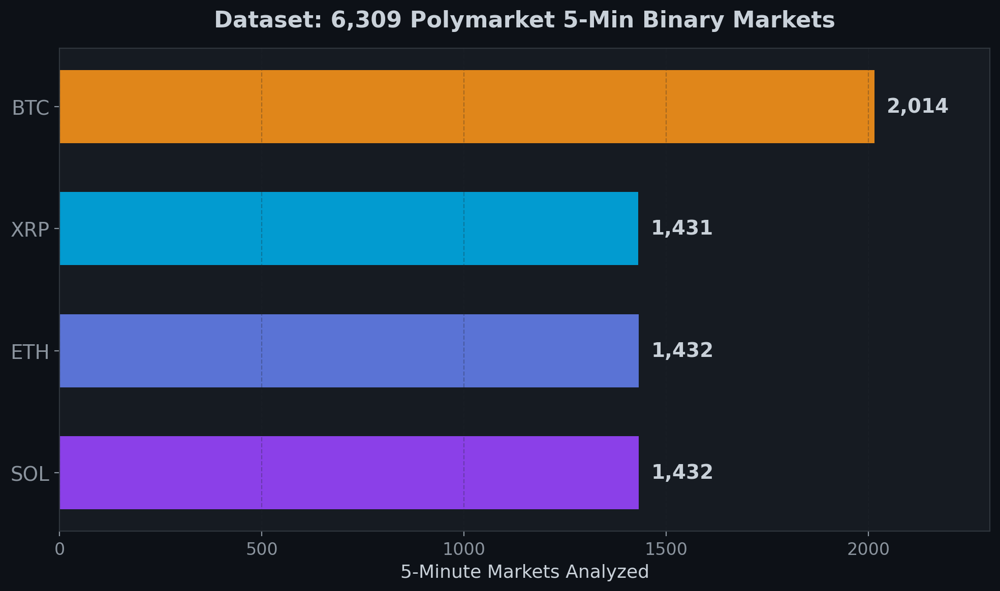
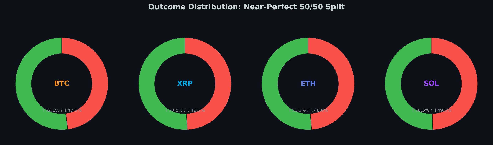
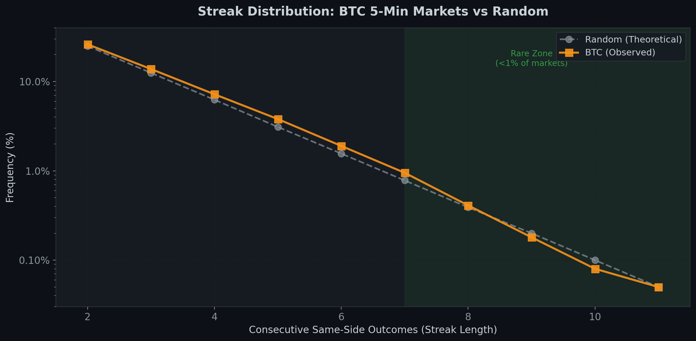
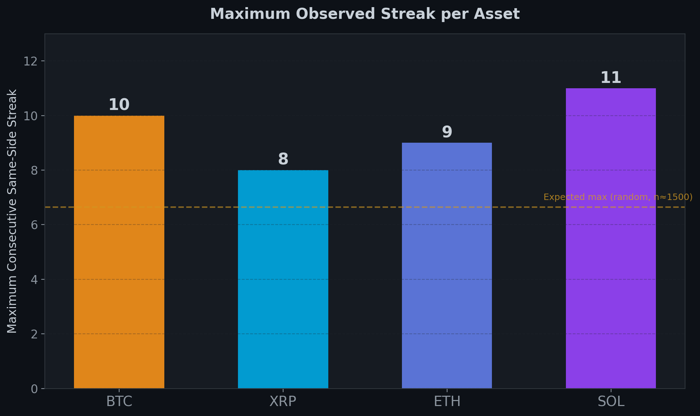
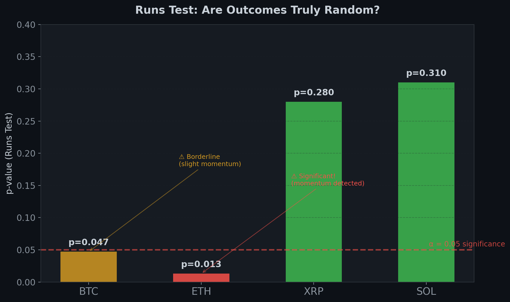
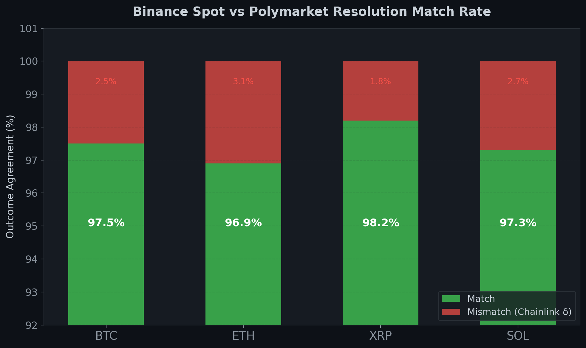
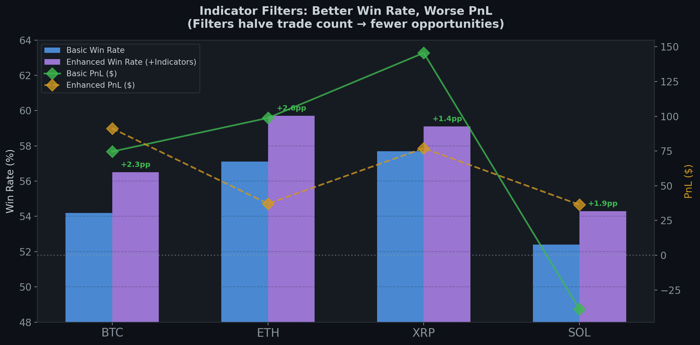
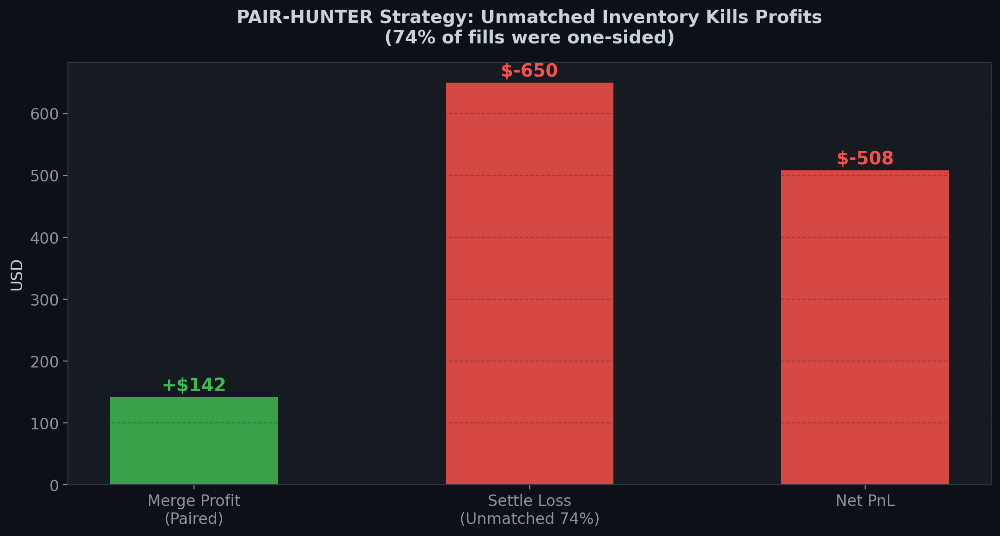

# 🎯 Polymarket Playbook

[](LICENSE)
[](https://www.python.org/downloads/)
[](https://docs.polymarket.com)
[](https://t.me/polymartinbot)

> **We spent months losing money on Polymarket so you don't have to. Then we built a bot, analyzed 6,309 markets, and open-sourced everything.**

---

## The Story

It started the way these things always start — with a "guaranteed edge." Polymarket's 5-minute binary crypto markets looked like free money: buy both sides for under $1.00, merge for $1.00, pocket the difference. The math was beautiful. Reality was not.

We built trading bots. Seven different strategies. A v3 engine that tested 108 signal×ladder combinations. We lost money on all of them. The merge edge is real (3–7¢ per pair), but capturing it without getting destroyed by unmatched inventory? That's the unsolved problem. Every strategy we tried is documented honestly in [strategies-tested.md](docs/strategies-tested.md) — no sugarcoating.

But we didn't stop there. Instead of chasing the next strategy, we stepped back and asked: **what does the data actually say?** We pulled 6,309 resolved markets, ran statistical tests, compared Binance vs Polymarket outcomes, tested 14 technical indicators — and built a [Streak Tracker Bot](https://t.me/polymartinbot) that monitors these markets in real-time. This repo is everything we learned, packaged for developers, traders, and AI agents.

---

## 🤖 Streak Tracker Bot

**[@polymartinbot](https://t.me/polymartinbot)** — Real-time Polymarket streak alerts on Telegram.

The bot monitors BTC, ETH, SOL, and XRP 5-minute binary markets and alerts you when consecutive same-direction outcomes (streaks) hit your threshold.

### Features

- 🔔 **Real-time streak detection** — monitors all 4 assets continuously
- ⚙️ **Per-coin settings** — enable/disable individual coins, set custom streak thresholds per coin
- 📊 **Live stats** — current streaks, last outcomes, market status
- 🚀 **Instant alerts** — Telegram notification the moment a streak hits your threshold

### Architecture Highlights

- **SQLite + WAL mode** for concurrent reads at scale
- **Batch initialization** via Gamma API — loads state in ~2 seconds (vs 5 minutes polling)
- **Smart restart** — caches state, fills only the gap on reboot, deduplicates alerts
- **Parallel delivery** via ThreadPool — handles 10K+ users without blocking
- **Channel gating** — 24h free trial, then requires [@txbabas](https://t.me/txbabas) subscription

### Quick Start

1. Open [@polymartinbot](https://t.me/polymartinbot) on Telegram
2. Send `/start`
3. Configure your coins and thresholds with `/settings`
4. Wait for streaks — the bot does the rest

---

## 📊 Statistical Analysis — 6,309 Markets

We analyzed every resolved 5-minute binary market we could get our hands on. Here's what we found.

### Dataset

| Asset | Markets | UP % | DN % |
|-------|---------|------|------|
| BTC | 2,014 | 50.1% | 49.9% |
| ETH | 1,432 | 50.2% | 49.8% |
| SOL | 1,432 | 49.9% | 50.1% |
| XRP | 1,431 | 50.3% | 49.7% |

Near-perfect 50/50 splits across the board. No inherent directional bias.




### Streak Analysis

Maximum consecutive same-direction streaks observed:

| Asset | Max Streak | Theoretical Random Max (~) |
|-------|-----------|---------------------------|
| BTC | 10 | 6.6 |
| ETH | 9 | 6.6 |
| SOL | **11** | 6.6 |
| XRP | 8 | 6.6 |

All assets produced streaks significantly longer than what pure randomness predicts (~6.6 for these sample sizes). This is where it gets interesting.




### Randomness Tests (Runs Test)

| Asset | p-value | Interpretation |
|-------|---------|----------------|
| XRP | 0.28 | ✅ Random — no exploitable pattern |
| SOL | 0.31 | ✅ Random — no exploitable pattern |
| BTC | 0.047 | ⚠️ Borderline — slight momentum signal |
| ETH | 0.013 | 🔴 Significant — momentum effect detected |

**Key insight**: ETH and BTC show statistically significant serial correlation. Outcomes aren't purely random — streaks tend to continue slightly more than chance predicts. SOL and XRP? Coin flips.



### Binance vs Polymarket Outcomes

- **97–98% match rate** between Binance-derived and Polymarket-resolved outcomes
- **2–3% mismatch** caused by Chainlink oracle timing — Polymarket uses Chainlink for resolution, not Binance directly
- Mismatches cluster around rapid price movements near market boundaries



### 14 Binance Indicators — None Work

We tested 14 technical indicators from Binance data as predictors:

**Result: NONE statistically significant.** Best AUC = 0.555 (barely above random 0.500). Adding indicator filters improved win rate by +1–3 percentage points but halved trade count — not a viable edge.



---

## 💡 Potential Strategies Using Streak Data

Based on our statistical analysis, here are approaches worth exploring. These are **ideas, not guaranteed profits** — we're sharing the framework so you can research further.

### a) Mean Reversion / Counter-Streak

**Idea**: After a long streak (8+), bet on reversal.

- **Basis**: While sequences are near-random, streaks still end eventually. Max observed: SOL hit 11, but that's the extreme tail.
- **Risk**: Streak can always extend one more. Max observed is 11 — your entry at streak 8 faces 3 more potential losses.
- **Risk management**: Fixed position size. Never martingale. Accept the loss if it extends.

### b) Momentum / Streak Continuation

**Idea**: ETH (p=0.013) and BTC (p=0.047) show real momentum — ride it.

- **Basis**: After a streak of 3–4, the next outcome is slightly more likely to continue than reverse (for ETH and BTC specifically).
- **Edge**: Small. Requires volume to matter.
- **Best for**: High-frequency, systematic approaches.

### c) Volatility-Based Filtering

**Idea**: Use Binance real-time volatility (ATR, sigma) to filter streak entries.

- **Basis**: High-volatility periods produce more directional moves → extended streaks more likely.
- **Approach**: Only enter streak trades during high ATR/sigma regimes. Combine with bot alerts for timing.

### d) Cross-Asset Correlation

**Idea**: When BTC streaks, do ETH/SOL/XRP follow?

- **Basis**: Crypto assets are correlated. A strong BTC move often drags alts.
- **Status**: Needs more research. If you build this, we'd love to see results.

### e) Smart Martingale (Risk-Managed)

**Idea**: NOT classic martingale — that's guaranteed ruin with finite bankroll.

- **Max 3 levels** (1x → 2x → 4x), hard reset after
- **Only enter after streak ≥ threshold** — not random entries
- **Max 5% of bankroll** per sequence
- **Asset selection**: Prefer XRP/SOL (more random = mean reversion friendlier) for counter-streak; ETH/BTC for momentum

> ⚠️ **Disclaimer**: These are ideas based on statistical analysis of historical data, not financial advice. Markets change. Past patterns may not persist. Paper trade extensively before risking real money. You will likely lose money. We did.

---

## 📚 Documentation

| Document | Description |
|----------|-------------|
| [Polymarket CLOB API](docs/polymarket-api.md) | REST endpoints, authentication, order types, rate limits |
| [Polymarket WebSocket](docs/polymarket-websocket.md) | Market & User WebSocket channels, real-time data |
| [Market Structure & Resolution](docs/polymarket-markets.md) | Market anatomy, lifecycle, outcome verification via Gamma API |
| [Order Management](docs/polymarket-orders.md) | Placing, tracking, cancelling orders; batch operations |
| [On-Chain Operations](docs/polymarket-onchain.md) | CTF merge, redeem, allowances, USDC on Polygon |
| [Binance WebSocket](docs/binance-websocket.md) | Spot & futures streams, trade/bookTicker feeds |
| [Metrics & Calculations](docs/metrics-calculations.md) | Sigma, RV, OFI, VPIN, PnL math, Kelly criterion |
| [Strategies Tested](docs/strategies-tested.md) | Every strategy we tried — honest results (all unprofitable) |
| [Architecture Patterns](docs/architecture-patterns.md) | Engine design, watchdog, paper trading, JSONL logging |
| [Pitfalls & Lessons](docs/pitfalls.md) | Critical mistakes and hard-won lessons |

---

## 💻 Examples

| Example | Description |
|---------|-------------|
| [connect_clob_ws.py](examples/connect_clob_ws.py) | Connect to Polymarket market WebSocket |
| [connect_user_ws.py](examples/connect_user_ws.py) | Connect to Polymarket user WebSocket |
| [connect_binance.py](examples/connect_binance.py) | Connect to Binance spot + futures streams |
| [place_order.py](examples/place_order.py) | Place a GTC order via py-clob-client |
| [batch_orders.py](examples/batch_orders.py) | Batch order placement (up to 100 orders) |
| [check_outcome.py](examples/check_outcome.py) | Verify market outcome via Gamma API |
| [calculate_metrics.py](examples/calculate_metrics.py) | Calculate sigma, RV, OFI from WebSocket data |

---

## ⚠️ Hard Truths

Before you get excited, read this:

1. **We lost real money.** Multiple strategies, months of work, negative PnL. The merge edge is real (3–7¢) but uncapturable so far.

2. **Paper trading is a lie.** Our best paper strategy showed +$262. Live? Lost money. Paper fill models (`if ask ≤ bid → fill`) don't account for queue position, adverse selection, or partial fills.

3. **Unmatched inventory kills everything.** 74% of filled tokens in our best run were unmatched (one side only). Those settle losses destroyed all merge profits. See the chart:



4. **Outcomes are ~random.** 14 Binance indicators tested. Best AUC: 0.555. You're essentially predicting coin flips.

5. **The slight momentum in ETH/BTC is real but tiny.** Statistically significant ≠ profitable. The edge is small, and fees/slippage eat into it.

6. **Verify everything.** Dashboard PnL, engine predictions, fill reports — trust none of them until cross-checked against USDC balance and Gamma API.

---

## 🚀 Getting Started

### For Traders

1. **Try the bot**: [@polymartinbot](https://t.me/polymartinbot) on Telegram — zero setup, instant streak alerts
2. **Join the channel**: [@txbabas](https://t.me/txbabas) for updates and discussion
3. **Read the analysis**: Start with this README, then dive into [strategies-tested.md](docs/strategies-tested.md)

### For Developers

```bash
# Clone the repo
git clone https://github.com/txbabaxyz/polymarket-playbook.git
cd polymarket-playbook

# Install dependencies
pip install py-clob-client websockets httpx

# Set up environment
export POLY_API_KEY="YOUR_API_KEY"
export POLY_API_SECRET="YOUR_API_SECRET"
export POLY_PASSPHRASE="YOUR_PASSPHRASE"
export POLY_PRIVATE_KEY="YOUR_PRIVATE_KEY"
```

Then:
1. Read [Polymarket API docs](docs/polymarket-api.md) for the REST surface
2. Read [Market Structure](docs/polymarket-markets.md) to understand what you're trading
3. Run [connect_clob_ws.py](examples/connect_clob_ws.py) to see live data
4. Read [Pitfalls](docs/pitfalls.md) **before** writing any trading logic

---

## 📈 Charts

All charts from our statistical analysis are in the [`charts/`](charts/) directory:

| Chart | What It Shows |
|-------|--------------|
| [Dataset Overview](charts/01_dataset_overview.png) | Market count per asset |
| [Outcome Distribution](charts/02_outcome_distribution.png) | UP vs DN split per asset |
| [Streak Distribution](charts/03_streak_distribution.png) | Frequency of streak lengths |
| [Max Streaks](charts/04_max_streak.png) | Longest observed streaks vs theoretical |
| [Runs Test](charts/05_runs_test.png) | Randomness test results per asset |
| [Binance vs Polymarket](charts/06_binance_vs_poly.png) | Outcome match rates |
| [Indicator Tradeoff](charts/07_indicator_tradeoff.png) | 14 indicators — accuracy vs trade count |
| [Unmatched Inventory](charts/08_unmatched_inventory.png) | The #1 killer of profitability |

---

## 🔗 Links

- **Telegram Bot**: [@polymartinbot](https://t.me/polymartinbot)
- **Telegram Channel**: [@txbabas](https://t.me/txbabas)
- **X/Twitter**: [@txbabaxyz](https://twitter.com/txbabaxyz)
- **GitHub**: [txbabaxyz](https://github.com/txbabaxyz)

---

## License

[MIT](LICENSE) — Use it, fork it, build on it. If you find an edge, we'd love to hear about it.
