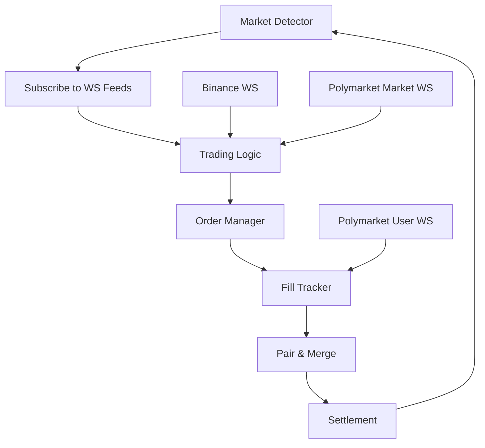
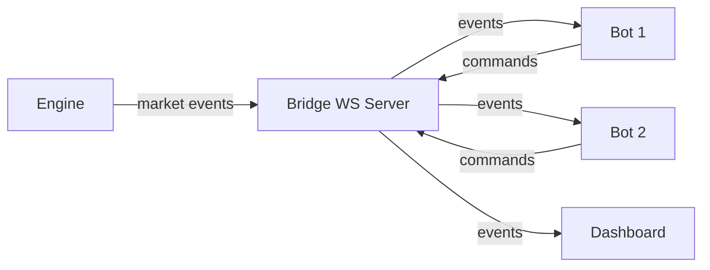

# System Architecture Patterns

> Design patterns for building Polymarket trading systems.

## Table of Contents

- [Engine Pattern](#engine-pattern)
- [Bridge WebSocket](#bridge-websocket)
- [Watchdog Pattern](#watchdog-pattern)
- [Paper Trading Simulation](#paper-trading-simulation)
- [JSONL Logging](#jsonl-logging)
- [Dashboard Pattern](#dashboard-pattern)

---

## Engine Pattern

The **engine** is the central orchestrator managing market lifecycles.



### Market Lifecycle Manager

```python
class Engine:
    """Manages the lifecycle of each market."""
    
    async def run(self):
        while True:
            # 1. DETECT — Find new markets
            market = await self.detect_new_market()
            
            # 2. SUBSCRIBE — Connect to WebSocket feeds
            await self.subscribe(market)
            
            # 3. TRADE — Execute strategy during trading window
            await self.trade(market)
            
            # 4. SETTLE — After market closes
            await self.cancel_open_orders(market)
            await self.merge_pairs(market)
            await self.wait_for_resolution(market)
            await self.redeem_winners(market)
            
            # Log results
            await self.log_results(market)
```

### Key Design Decisions

1. **One market at a time** vs **concurrent markets**: Start with one. Concurrent adds complexity without proven edge.
2. **State machine**: Each market moves through states: `DETECTED → SUBSCRIBED → TRADING → CLOSING → SETTLING → DONE`
3. **Graceful shutdown**: Must cancel all orders before stopping. Orphaned orders = uncontrolled exposure.

---

## Bridge WebSocket

Pattern for connecting external bots/UIs to the engine.



### Implementation

```python
import asyncio
import websockets
import json

class BridgeServer:
    """WebSocket bridge between engine and clients."""
    
    def __init__(self, host="localhost", port=8765):
        self.clients = set()
        self.host = host
        self.port = port
    
    async def register(self, ws):
        self.clients.add(ws)
    
    async def unregister(self, ws):
        self.clients.discard(ws)
    
    async def broadcast(self, event: dict):
        """Send event to all connected clients."""
        msg = json.dumps(event)
        for client in self.clients.copy():
            try:
                await client.send(msg)
            except websockets.ConnectionClosed:
                await self.unregister(client)
    
    async def handler(self, ws):
        await self.register(ws)
        try:
            async for msg in ws:
                # Handle commands from clients
                cmd = json.loads(msg)
                await self.handle_command(cmd)
        finally:
            await self.unregister(ws)
    
    async def start(self):
        async with websockets.serve(self.handler, self.host, self.port):
            await asyncio.Future()  # Run forever
```

### Event Types

```python
# Market detected
{"type": "market_detected", "slug": "btc-updown-5m-1700000000", "condition_id": "0x..."}

# Trading started
{"type": "trading_started", "slug": "...", "up_token": "...", "dn_token": "..."}

# Fill received
{"type": "fill", "side": "UP", "price": 0.47, "size": 50, "source": "maker"}

# Pair completed
{"type": "pair_complete", "pairs": 10, "merge_edge": 0.03}

# Market resolved
{"type": "resolved", "outcome": "Up", "merge_pnl": 3.00, "settle_pnl": -1.50}
```

---

## Watchdog Pattern

Health monitoring with automatic restart for long-running processes.

```python
import asyncio
import subprocess
import time

class Watchdog:
    """Monitor and restart the engine process."""
    
    def __init__(self, command: list[str], health_check_interval: int = 30):
        self.command = command
        self.interval = health_check_interval
        self.process = None
        self.restart_count = 0
        self.max_restarts = 10
    
    async def start(self):
        while self.restart_count < self.max_restarts:
            self.process = subprocess.Popen(self.command)
            print(f"Started engine (PID: {self.process.pid})")
            
            while True:
                await asyncio.sleep(self.interval)
                
                if self.process.poll() is not None:
                    print(f"Engine died (exit code: {self.process.returncode})")
                    self.restart_count += 1
                    break
                
                if not await self.health_check():
                    print("Health check failed, restarting...")
                    self.process.terminate()
                    self.restart_count += 1
                    break
        
        print(f"Max restarts ({self.max_restarts}) reached. Giving up.")
    
    async def health_check(self) -> bool:
        """Check if engine is responsive."""
        # Example: check if log file was updated recently
        # Or: ping the bridge WebSocket
        # Or: check if orders are being placed
        return True  # Implement your check
```

---

## Paper Trading Simulation

Fill model for backtesting without real orders.

### Simple Fill Model

```python
class PaperTrader:
    """Simulate order fills based on market data."""
    
    def __init__(self):
        self.open_orders = []  # (side, token_id, price, size)
        self.fills = []
    
    def place_order(self, side: str, token_id: str, price: float, size: float):
        """Place a simulated order."""
        self.open_orders.append({
            "side": side,
            "token_id": token_id,
            "price": price,
            "size": size,
            "placed_at": time.time(),
        })
    
    def on_book_update(self, token_id: str, best_bid: float, best_ask: float):
        """
        Check if any orders would fill.
        
        Simple model: BUY fills if best_ask <= order_price
        
        ⚠️ THIS IS MUCH MORE OPTIMISTIC THAN REAL EXECUTION!
        Real fills depend on queue position, liquidity, timing.
        """
        remaining = []
        for order in self.open_orders:
            if order["token_id"] != token_id:
                remaining.append(order)
                continue
            
            if order["side"] == "BUY" and best_ask <= order["price"]:
                self.fills.append({**order, "fill_price": best_ask})
            elif order["side"] == "SELL" and best_bid >= order["price"]:
                self.fills.append({**order, "fill_price": best_bid})
            else:
                remaining.append(order)
        
        self.open_orders = remaining
```

### Limitations

⚠️ **Paper trading results are NOT indicative of live performance.** Reasons:
1. No queue position modeling — in reality, your order is behind others at the same price
2. No adverse selection — paper fills assume you get filled at good prices, but real fills often happen when price moves against you
3. No partial fills — paper model fills entire order or nothing
4. No latency — paper fills are instant, real fills take network + matching time

---

## JSONL Logging

Structured logging for trade analysis.

### Format

Each line is a JSON object with a `type` field:

```jsonl
{"type": "market_start", "ts": 1700000000, "slug": "btc-updown-5m-1700000000", "condition_id": "0x..."}
{"type": "order_placed", "ts": 1700000005, "side": "UP", "price": 0.47, "size": 50, "order_id": "0x..."}
{"type": "fill", "ts": 1700000010, "side": "UP", "price": 0.47, "size": 50, "source": "maker"}
{"type": "fill", "ts": 1700000015, "side": "DN", "price": 0.51, "size": 30, "source": "taker"}
{"type": "merge", "ts": 1700000020, "pairs": 30, "merge_pnl": 0.60}
{"type": "market_end", "ts": 1700000300, "outcome": "Up", "total_pnl": -2.50}
```

### Writer

```python
import json

class TradeLogger:
    def __init__(self, path: str):
        self.file = open(path, "a")
    
    def log(self, event: dict):
        event["ts"] = time.time()
        self.file.write(json.dumps(event) + "\n")
        self.file.flush()
    
    def close(self):
        self.file.close()
```

---

## Dashboard Pattern

Reading JSONL logs and aggregating by strategy.

```python
import json
from collections import defaultdict

def analyze_log(path: str) -> dict:
    """Aggregate trading results from JSONL log."""
    markets = defaultdict(lambda: {
        "fills_up": 0, "fills_dn": 0,
        "merge_pnl": 0.0, "settle_pnl": 0.0,
    })
    
    current_slug = None
    
    with open(path) as f:
        for line in f:
            event = json.loads(line.strip())
            
            if event["type"] == "market_start":
                current_slug = event["slug"]
            
            elif event["type"] == "fill":
                if event["side"] == "UP":
                    markets[current_slug]["fills_up"] += event["size"]
                else:
                    markets[current_slug]["fills_dn"] += event["size"]
            
            elif event["type"] == "merge":
                markets[current_slug]["merge_pnl"] += event["merge_pnl"]
            
            elif event["type"] == "market_end":
                markets[current_slug]["settle_pnl"] = (
                    event["total_pnl"] - markets[current_slug]["merge_pnl"]
                )
    
    # Summary
    total_merge = sum(m["merge_pnl"] for m in markets.values())
    total_settle = sum(m["settle_pnl"] for m in markets.values())
    
    return {
        "total_markets": len(markets),
        "total_merge_pnl": total_merge,
        "total_settle_pnl": total_settle,
        "total_pnl": total_merge + total_settle,
        "avg_pnl_per_market": (total_merge + total_settle) / max(len(markets), 1),
    }
```

---

*See also: [Strategies Tested](strategies-tested.md) · [Metrics](metrics-calculations.md) · [Pitfalls](pitfalls.md)*
