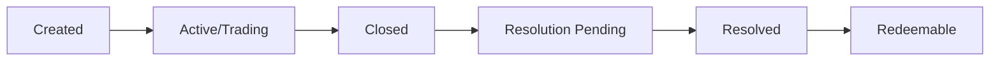

# Polymarket Market Structure & Resolution

> How markets work, from creation to resolution.

## Table of Contents

- [Market Anatomy](#market-anatomy)
- [BTC 5-Minute Binary Options](#btc-5-minute-binary-options)
- [Market Lifecycle](#market-lifecycle)
- [Outcome Resolution via Gamma API](#outcome-resolution-via-gamma-api)
- [Chainlink Oracle](#chainlink-oracle)
- [UMA Protocol Resolution](#uma-protocol-resolution)
- [Terminology](#terminology)

---

## Market Anatomy

Every Polymarket binary market has:

| Field | Description | Example |
|-------|-------------|---------|
| `condition_id` | Unique market identifier (hex) | `0xabc123...` |
| `tokens[0].token_id` | UP/Yes token ID (large integer) | `71321045...` |
| `tokens[1].token_id` | DN/No token ID (large integer) | `52114903...` |
| `slug` | Human-readable URL slug | `will-btc-be-above-50000` |
| `question` | Market question text | "Will BTC be above $50,000?" |
| `outcomes` | Possible outcomes | `["Up", "Down"]` or `["Yes", "No"]` |
| `minimum_tick_size` | Price increment | `"0.01"` or `"0.001"` |
| `neg_risk` | Negative risk market flag | `true` or `false` |

## BTC 5-Minute Binary Options

These are the most active short-term markets on Polymarket.

### Slug Format

```
btc-updown-5m-{unix_timestamp}
```

The `unix_timestamp` is the **start time** of the 5-minute window.

Example: `btc-updown-5m-1700000000` for a market starting at Unix epoch 1700000000.

### How They Work

1. Market opens — BTC reference price is set (via Chainlink oracle)
2. 5-minute window begins — trade UP or DN tokens
3. Window closes — final BTC price is compared to reference
4. If BTC went up → UP token = $1.00, DN token = $0.00
5. If BTC went down → DN token = $1.00, UP token = $0.00

---

## Market Lifecycle



1. **Created**: Market appears on the platform, tokens exist but may not trade yet
2. **Active/Trading**: Order book is open, bids and asks accepted
3. **Closed**: Trading window ends, no new orders accepted
4. **Resolution Pending**: Oracle/UMA determining outcome
5. **Resolved**: Outcome finalized, `umaResolutionStatus == "resolved"`
6. **Redeemable**: Winning tokens can be redeemed for USDC

---

## Outcome Resolution via Gamma API

> ⚠️ **THIS IS THE ONLY CORRECT METHOD** to determine market outcomes.

### Endpoint

```
GET https://gamma-api.polymarket.com/markets?slug={slug}
```

### Verification Process

```python
import httpx
import time

def check_outcome(slug: str, max_retries: int = 10) -> str | None:
    """
    Check market outcome via Gamma API.
    Returns 'Up', 'Down', or None if not yet resolved.
    """
    url = f"https://gamma-api.polymarket.com/markets?slug={slug}"

    for attempt in range(max_retries):
        resp = httpx.get(url)
        data = resp.json()

        if not data:
            time.sleep(2)
            continue

        market = data[0]

        # STEP 1: Check resolution status FIRST
        if market.get("umaResolutionStatus") != "resolved":
            print(f"Not yet resolved (attempt {attempt + 1})")
            time.sleep(5)
            continue

        # STEP 2: Parse outcome prices
        outcomes = market["outcomes"]       # ["Up", "Down"]
        prices = market["outcomePrices"]    # ["1", "0"] or ["0", "1"]

        # The outcome with price "1" is the winner
        for outcome, price in zip(outcomes, prices):
            if price == "1":
                return outcome

    return None  # Not resolved within retries
```

### Critical Rules

1. **ALWAYS check `umaResolutionStatus == "resolved"` FIRST** — if not resolved, the outcome prices are meaningless
2. **The winner has `outcomePrices` = `"1"`**, the loser has `"0"`
3. **NEVER guess outcomes** from mid-market prices (e.g., "price > 0.5 means it's winning")
4. **NEVER use live trading prices** as resolution indicator
5. **Retry if not yet resolved** — resolution can take seconds to minutes after market close
6. **Parse as strings** — `"1"` not `1`, `"0"` not `0`

### Why This Matters

We lost real money because our outcome verification was buggy:
- Checking too early got `null` prices → treated as "Down" → wrong PnL tracking
- Using mid-prices > 0.5 as proxy → unreliable, especially during volatile resolution
- Not waiting for `"resolved"` status → got stale/intermediate values

---

## Chainlink Oracle

For BTC 5-minute markets, Polymarket uses **Chainlink price feeds** on Polygon to determine the reference and final prices.

- The **engine** can detect the likely outcome early by reading the Chainlink oracle directly
- However, this is for **early detection only** — the official outcome still requires UMA resolution
- Chainlink updates may lag 1-2 blocks, so edge cases exist

### How the Engine Uses It

```
1. Market opens → Engine reads Chainlink BTC/USD price as reference
2. Market closes → Engine reads final Chainlink price
3. If final > reference → likely "Up"
4. But: ALWAYS confirm via Gamma API before settling positions
```

## UMA Protocol Resolution

Polymarket uses the **UMA Optimistic Oracle** for dispute resolution:

1. An outcome is **proposed** by anyone (posts ~$750 USDC.e bond)
2. **2-hour challenge period** — anyone can dispute by posting counter-bond
3. If unchallenged → proposal accepted, market resolves
4. If 1st dispute → new proposal round. If 2nd dispute → escalates to **UMA DVM** token holder vote (~48h)

### Resolution Timeline

| Scenario | Duration |
|----------|----------|
| Undisputed | ~2 hours |
| One dispute | ~4 days |
| Two disputes (DVM vote) | ~4-6 days |

### UMA Adapter Contracts (Polygon)

| Version | Address |
|---------|---------|
| v3.0 | `0x157Ce2d672854c848c9b79C49a8Cc6cc89176a49` |
| v2.0 | `0x6A9D222616C90FcA5754cd1333cFD9b7fb6a4F74` |
| v1.0 | `0xCB1822859cEF82Cd2Eb4E6276C7916e692995130` |

### Clarifications

In rare cases, Polymarket may issue **"Additional context"** updates published onchain via the bulletin board contract. These cannot change the fundamental question but guide resolution.

For 5-minute BTC markets, resolution is typically fast (under a minute) since outcomes are objective.

## Sports Markets

For sports markets, outstanding limit orders are **automatically cancelled** once the game begins. However, if a game starts earlier than scheduled, orders may not be cleared in time.

Sports markets have a **3-second matching delay** for marketable orders (`delayed` status).

## Holding Rewards

Polymarket pays **4.00% annualized** Holding Rewards on total position value in eligible markets. Sampled randomly once per hour, distributed daily. Rate is variable.

---

## Terminology

| Term | Definition |
|------|-----------|
| **Favorite** | The token trading > $0.50 — the market thinks this outcome is more likely |
| **Underdog** | The token trading < $0.50 — the market thinks this outcome is less likely |
| **Merge** | Combining 1 UP + 1 DN token → $1.00 USDC (always works, pre-resolution) |
| **Redeem** | Claiming $1.00 per winning token after resolution |
| **CTF** | Conditional Token Framework — the smart contract standard for outcome tokens |
| **Neg Risk** | Market flag affecting how margin and risk are calculated |

---

*See also: [CLOB API](polymarket-api.md) · [On-Chain Operations](polymarket-onchain.md) · [Pitfalls](pitfalls.md)*
